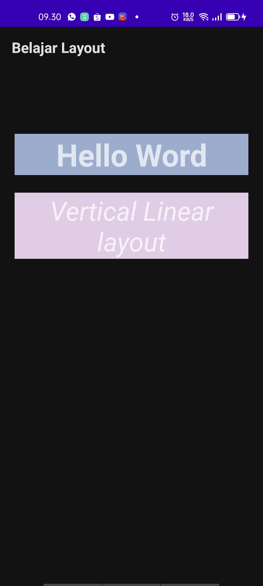
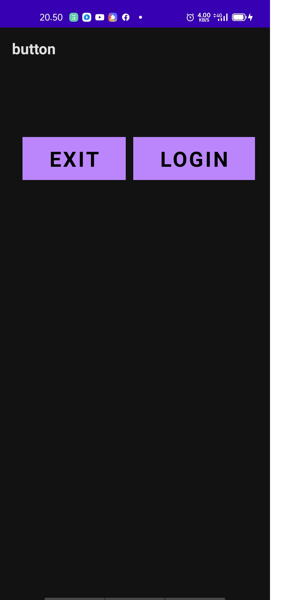
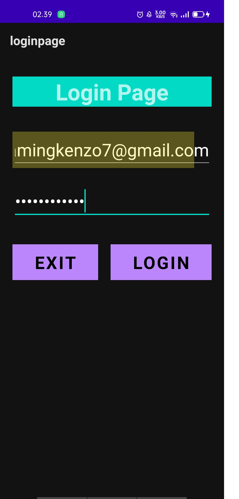

# 02 - Layout dan Activity

## Tujuan Pembelajaran

1. Mahasiswa akan membuat halaman login sederhana menggunakan LinearLayout

## Hasil Praktikum

## LINEAR LAYOUT - EDITTEXT COMPONENTS
## Hasil Praktikum

## LINEAR LAYOUT - BUTTON
## Hasil Praktikum

## LINEAR LAYOUT - NESTED VIEW
## Hasil Praktikum

## LINEAR LAYOUT - LOGIN PAGE
## Hasil Praktikum
