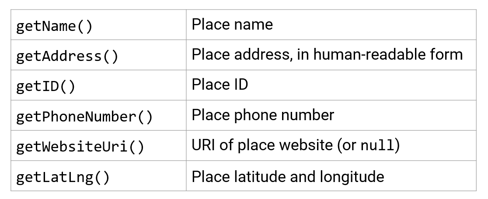
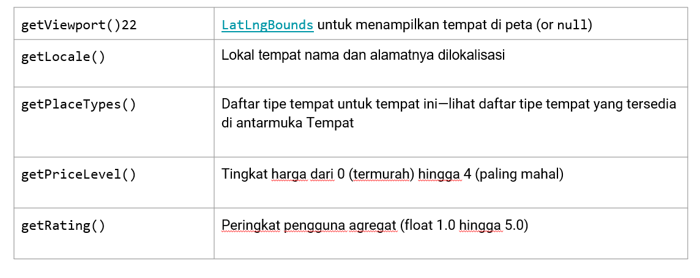

# 11 - Location

# Rangkuman Pertemuan 11
Beberapa Modul Yang Saya Baca

3.1 Sensor Basics

Kategori dan tipe sensor
        1. Sensor Gerak
        2. Sensor Lingkungan
        3. Sensor Posisi

    Alat ukur gerakan
        - Akselerometer
        - Sensor Gravitasi
        - Giroskop
        - Sensor vektor rotasi

    
    Alat ukur kondisi lingkungan
        - Barometers
        - Photometers (sensor cahaya)
        - Thermometers

    
    Alat ukur posisi fisik
        - Magnetometers (sensor medan geomagnetik)
        - Sensor Proximity

    Jenis sensor yang di dukung oleh platform Android
        - Sensor berbasis perangkat keras
        - Sensor berbasis perangkat lunak

    Sensor berbasis perangkat keras
        Komponen fisik dibangun ke dalam perangkat
            - Data diperoleh dengan langsung mengukur properti tertentu
            - Contoh : sensor cahaya, sensor jarak, magnetometer, accelerometer

    Sensor berbasis perangkat lunak
        Perangkat lunak : sensor virtual atau komposit
            - Data berasal dari satu atau lebih sensor perangkat keras
            - Contoh : percepatan linier, orientasi

    
    Ketersediaan sensor
        Ketersediaan sensor bervariasi dari perangkat ke perangkat, itu juga dapat bervariasi antara versi Android
            - Sebagian besar perangkat memiliki akselerometer dan magnetometer
            - Beberapa perangkat memiliki barometer atau termometer
            - Perangkat dapat memiliki lebih dari satu sensor dari jenis tertentu
            - Ketersediaan bervariasi antara versi Android

    
    Emulating sensors
        Sensor dan Android emulator
            Virtual sensor control untuk testing:
                Di emulator, gunakan panel di sisi kanan, pilih Virtual sensor
                - Halaman Accelerometer:
                    Uji aplikasi untuk perubahan posisi dan/atau orientasi perangkat
                - Halaman sensor tambahan:
                    Simulasikan sensor posisi dan lingkungan

        Emulator: Halaman Accelerometer
            - Mensimulasikan gerakan perangkat seperti kemiringan dan rotasi
            - Mensimulasikan cara akselerometer dan magnetometer merespons
            - Bidang Nilai yang dihasilkan menunjukkan nilai aplikasi dapat mengakses

        Emulator: Halaman sensor tambahan
            - Suhu sekitar
            - Magnetic field at the x-axis, y-axis, and z-axis.Values are in microtesla (μT)
            - Proximity: Distance of device from object
            - Light: Measures illuminance
            - Pressure: Measures ambient air pressure
            - Relative humidity

    Kerangka Sensor Android
        Kelas dan antarmuka kerangka kerja
            Sensor Manager
                - Akses dan dengarkan sensor
                - Daftar dan batalkan pendaftaran pendengar acara sensor
                - Dapatkan informasi orientasi
                - Provides constants for accuracy, data acquisition rates, and calibration

        Kelas kerangka kerja penting
            - Sensor: Tentukan kemampuan sensor tertentu
            - SensorEvent: Info tentang acara, termasuk data sensor mentah
            - SensorEventListener: Menerima pemberitahuan tentang peristiwa sensor
                * Ketika sensor punya data baru
                * Ketika akurasi sensor berubah
        
        Jenis kelas sensor dan tipe kegunaan
            - Tipe Accelerometer -> Deteksi gerakan
            - Tipe Ambient Temperature -> Monitoring temperature udara
            - Tipe Gravity -> Deteksi gerakan
            - Tipe Gyroscope -> Deteksi putaran
            - Tipe Cahaya -> Mengontrol kecerahan layar
            - Tipe LInear Acceleration -> Pemantauan akselerasi sepanjang sumbu tunggal
            - Tipe Magnetic field -> Membuat kompas
        
        Menggunakan sensor
            - Tentukan sensor mana yang tersedia di perangkat
            - Tentukan kemampuan sensor individu
            - Daftarkan penerima event sensor
            - Dapatkan data sensor mentah
            - Batalkan pendaftaran penerima event sensor
            
        
    Menemukan sensor dan kemampuan
        Identifikasi sensor
            Membuat sebuah instance dari SensorManager
            - Panggil getSystemService() 
            - Berikan argumen SENSOR_SERVICE
                mSensorManager = (SensorManager) 
                    getSystemService(Context.SENSOR_SERVICE);

        Mendapatkan daftar sensor
            - Untuk mendapatkan semua perangkat sensor, gunakan TYPE_ALL konstan
                List<Sensor> deviceSensors = mSensorManager.getSensorList(Sensor.TYPE_ALL);
            - Untuk mendapatkan sensor tipe tertentu, gunakan konstanta seperti TYPE_PROXIMITY, TYPE_GYROSCOPE, atau TYPE_GRAVITY
        
        Identifikasi fitur sensor
            Method class sensor
                - getResolution() untuk resolusi sensor
                - getMaximumRange() untuk rentang pengukuran maksimum
                - getPower() untuk kebutuhan daya sensor
                - getVendor() dan getVersion() untuk mengoptimalkan sensor yang berbeda atau versi sensor yang berbeda
                - getMinDelay() untuk menentukan kecepatan maksimum di mana sensor dapat memperoleh data
        
        Mengangani perbedaan konfigurasi sensor
            Menggunakan filter Google Play untuk target  perangkat
                - Filter Google Play menargetkan konfigurasi sensor tertentu
                    * Filter aplikasi dari perangkat yang tidak memiliki konfigurasi sensor
                    * <uses-feature> di manifes Android
                        <uses-feature 
                            android:name="android.hardware.sensor.accelerometer"
                            android:required="true" />

    
        Mendeteksi sensor yang berjalan
            - Deteksi sensor saat runtime untuk mematikan fitur aplikasi yang sesuai
            - Gunakan getDefaultSensor() dan berikan konstanta tipe untuk sensor tertentu seperti TYPE_PROXIMITY, TYPE_GYROSCOPE, atau TYPE_GRAVITY
            - Jika ada lebih dari satu sensor untuk jenis tertentu, sistem akan menetapkan satu sebagai default
            - Jika tidak ada tipe itu, metode mengembalikan null

    Monitoring event sensor
        Daftarkan penerima event sensor
            - Aplikasi harus mendaftarkan penerima untuk event sensor
            - Daftar di aktivitas onStart() dan batalkan pendaftaran di onStop()
                * Jangan mendaftar di onCreate(), onResume(), atau onPause()
                * Memastikan sensor menggunakan daya hanya saat aplikasi berada di latar depan
                * Sensor terus berjalan meskipun aplikasi dalam mode multi-jendela
    
        Daftarkan penerima dalan onStart()
            Daftarkan penerima event sensor untuk sensor tertentu
                @Override
                protected void onStart() {
                    super.onStart();
                    if (mIsLightSensorPresent) {
                        mSensorManager.registerListener(this, mSensorLight,
                                                SensorManager.SENSOR_DELAY_UI);
                    }
                }
        
        Batalkan pendaftaran pendengar di onStop()
            @Override
            protected void onStop() {
                super.onStop();
                mSensorManager.unregisterListener(this);
            }
        
        Pengawasan event sensor
            - Implementasikan antarmuka SensorEventListener dengan callback
                * onSensorChanged(SensorEvent event) 
                * onAccuracyChanged(Sensor sensor, int accuracy)
            - Dapatkan jenis dan nilai sensor dari objek SensorEvent
            - Perbarui aplikasi yang sesuai

        onAccuracyChanged()
            - onAccuracyChanged() dipanggil saat akurasi sensor berubah
            - Objek sensor mengidentifikasi sensor yang mengubah akurasi
            - Status akurasi konstan:
                * SENSOR_STATUS_ACCURACY_LOW
                * SENSOR_STATUS_ACCURACY_MEDIUM
                * SENSOR_STATUS_ACCURACY_HIGH
                * SENSOR_STATUS_UNRELIABLE
                * SENSOR_STATUS_NO_CONTACT
        
        onSensorChanged()
            - onSensorChanged() dipanggil saat sensor melaporkan data baru, meneruskan SensorEvent
            - Objek SensorEvent berisi informasi tentang data sensor baru
                * sensor: Sensor yang menghasilkan peristiwa (Objek sensor)
                * nilai: Data yang dihasilkan sensor, sebagai larik nilai float. Sensor yang berbeda memberikan jumlah dan jenis data yang berbeda.

------------------------------------------------------------------------------------------------------------------------------------------------
3.2 Motion and Position Sensors
    Gambaran sensor gerakan dan posisi
        Sensor gerakan dan posisi
            - Sensor gerak dan posisi memantau pergerakan atau posisi perangkat di ruang masing-masing
            - Keduanya mengembalikan array multi-dimensi dari nilai sensor untuk setiap SensorEvent
                *   Contoh: Akselerometer mengembalikan data gaya akselerasi untuk 3 sumbu koordinat (x, y, z) relatif terhadap perangkat
        
        Sistem koordinat
            - Sistem koordinat perangkat: Beberapa sensor menggunakan sistem koordinat perangkat relatif terhadap perangkat
                * Contoh: Akselerometer
            - Sistem koordinat bumi: Sensor lain menggunakan sistem koordinat bumi relatif terhadap permukaan bumi
                * Contoh: Magnetometer
        
        Perangkat koordinat
            - Relatif terhadap perangkat fisik terlepas dari posisi perangkat di dunia
            - x mendatar dan menunjuk ke kanan
            - y vertikal dan mengarah ke atas
            - z menunjuk ke arah luar layar
            - Poin z negatif di belakang layar
            - Relatif terhadap layar perangkat saat perangkat dalam orientasi default
            - Sumbu tidak ditukar ketika orientasi berubah dengan rotasi
            - Aplikasi harus mengubah data sensor yang masuk agar sesuai dengan rotasi
        
        Koordinat bumi
            - y points to magnetic north along Earth's surface 
            - x is 90 degrees from y, pointing east
            - z extends up into space
            - Negative z extends down into ground

    Menentukan orientasi perangkat
        Orientasi perangkat
            - Posisi perangkat relatif terhadap koordinat Bumi (y menunjuk ke utara magnetis)
            - Tentukan dengan menggunakan akselerometer dan sensor medan geomagnetik dengan metode di SensorManager

        Komponen orientasi
            - Azimuth
                Sudut antara arah kompas perangkat dan utara magnet
            - Pitch
                Sudut antara bidang yang sejajar dengan layar perangkat dan bidang yang sejajar dengan tanah
            - Roll
                Sudut antara bidang yang tegak lurus dengan layar perangkat dan bidang yang tegak lurus dengan tanah

        Method SensorManager
            - getRotationMatrix() menghasilkan matriks rotasi dari akselerometer dan sensor medan geomagnetik
            - getOrientation() menggunakan matriks rotasi untuk menghitung sudut orientasi perangkat

        
    Memahami rotasi perangkat
        Tranformasi koordinat untuk rotasi
            Jika aplikasi menarik tampilan berdasarkan data sensor:
                - Layar atau sistem koordinat aktivitas berputar dengan perangkat
                - Sistem koordinat sensor tidak berputar
                - Perlu mengubah koordinat sensor menjadi koordinat aktivitas

        Menangani perangkat dan rotasi aktivitas
            - Orientasi perangkat kueri dengan getRotationMatrix()
            - Memetakan ulang matriks rotasi dari data sensor ke koordinat aktivitas dengan remapCoordinateSystem()
        
        Dikembalikan dari getRotation()
            Konstanta integer: 
                - ROTATION_0: Default (potret untuk ponsel)
                - ROTATION_90: Samping (lanskap untuk ponsel)
                - ROTATION_180: Terbalik (jika perangkat memungkinkan)
                - ROTATION_270: Samping ke arah yang berlawanan
                - Banyak perangkat mengembalikan ROTATION_90 atau ROTATION_270 terlepas dari rotasi searah atau berlawanan arah jarum jam

    
    Menggunakan sensor gerak
        Sensor Gerak
            Gerakan biasanya merupakan cerminan dari:
                - Masukan pengguna langsung relatif terhadap perangkat/aplikasi (kemudi mobil dalam game, dll.)
                - Gerakan perangkat relatif terhadap Bumi (perangkat bersama Anda saat Anda mengemudi)
        
        Accelerometer
            - TYPE_ACCELEROMETER mengukur percepatan di sepanjang 3 sumbu perangkat (x, y, z) termasuk gravitasi
            - Akselerasi tanpa gravitasi: gunakan TYPE_LINEAR_ACCELERATION
            - Gaya gravitasi tanpa percepatan: gunakan TYPE_GRAVITY
            - TYPE_GYROSCOPE mengukur laju rotasi (radian/detik)
            - Untuk perhitungan, lihat nilai SensorEvent

        Sensor gravitasi dan gyroscope
            Sepanjang 3 sumbu perangkat (x, y, z):
                - TYPE_GRAVITY mengukur gravitasi tanpa percepatan
                - TYPE_GYROSCOPE mengukur laju rotasi (radian/detik)
                - Untuk perhitungan, lihat nilai SensorEvent
        
        Sensor Rotasi Vektor
            - TYPE_ROTATION_VECTOR memberikan orientasi sehubungan dengan Bumi yang dikoordinasikan sebagai unit quaternion
            - Sensor perangkat lunak yang mengintegrasikan data dari akselerometer, magnetometer, dan giroskop (jika tersedia)
            - Cara yang efisien dan akurat untuk menentukan orientasi perangkat
            - Untuk perhitungan, lihat nilai SensorEvent
        
        Penghitung langkah dan pendeteksi langkah
            - TYPE_STEP_COUNTER mengukur langkah pengguna sejak reboot terakhir
            - Untuk menghemat baterai, gunakan JobScheduler untuk mengambil nilai saat ini dari penghitung langkah pada interval tertentu
            - TYPE_STEP_DETECTOR: sensor perangkat keras yang memicu peristiwa untuk setiap langkah
            - Contoh: Lihat contoh aplikasi BatchStepSensor

Menggunakan sensor posisi
    Geomagnetic (magnetometer)
        - TYPE_MAGNETIC_FIELD mengukur kekuatan medan magnet di sekitar perangkat pada masing-masing 3 sumbu (x, y, z), termasuk medan magnet Bumi
        - Satuan dalam mikrotesla (uT)
        - Temukan posisi perangkat sehubungan dengan dunia luar (kompas)

    Orientasi
        - TYPE_ORIENTATION tidak digunakan lagi di API 8
        - Untuk orientasi perangkat yang akurat (pilih salah satu):
            * Gunakan getRotationMatrix() dan getOrientation(), atau
            * Gunakan sensor vektor rotasi dengan TYPE_ROTATION_VECTOR

-----------------------------------------------------------------------------------------------------------------------------------------------
## 7.1 Location Services
    Menyiapkan layanan Google Play
        Menyiapkan layanan Google Play
            Layanan lokasi disediakan oleh Layanan Google Play Instal Google Repository di Android Studio
                1. Pilih Tools > Android > SDK Manager
                2. Pilih halaman SDK Tools
                3. Perluas Support Repository
                4. Pilih Google Repository dan klik OK
        
        Menambahkan Google Play ke proyek Anda
            Tambahkan ke dependensi di build.gradle (Modul: aplikasi):
                compile 'com.google.android.gms:play-services:xx.x.x'

    Izin Lokasi
        Pengguna memilih untuk membagikan lokasi mereka
            Dari Marshmallow dan seterusnya:
                - Pengguna memberikan atau menolak akses ke lokasi mereka untuk setiap aplikasi
                - Pengguna dapat mengubah izin akses kapan saja
                - Aplikasi Anda dapat meminta pengguna untuk memberikan izin untuk menggunakan lokasi

            Untuk aplikasi yang dibuat sebelum Marshmallow:
                - Pengguna memberikan izin sebelum menginstal
                - Setelah instalasi, pengguna tidak dapat mengubah izin akses
                - Aplikasi Anda dapat memeriksa apakah izin telah diberikan

            Meminta izin lokasi
                Aplikasi harus meminta izin lokasi
                - ACCESS_COARSE_LOCATION untuk lokasi yang akurat di dalam blok kota
                - ACCESS_FINE_LOCATION untuk mendapatkan lokasi yang tepat
            
            Meminta izin saat menjalankan
                - Pengguna dapat mencabut izin kapan saja
                - Periksa izin setiap kali aplikasi Anda menggunakan lokasi
                - Detail dan contoh: Meminta Izin saat Runtime

            Langkah-langkah untuk memeriksa/meminta izin
                - Gunakan checkSelfPermission() untuk melihat apakah izin diberikan
                - Gunakan requestPermissions() untuk meminta izin
                - Periksa respons pengguna untuk melihat apakah permintaan dikabulkan

    Mendapatkan lokasi perangkat
        FusedLocationProviderClient
            - Gunakan FusedLocationProviderClient untuk meminta lokasi terakhir yang diketahui
            - Biasanya, lokasi terakhir yang diketahui sama dengan lokasi saat ini

        Dapatkan FusedLocationProviderClient
            Untuk mendapatkan FusedLocationProviderClient:
                FusedLocationProviderClient flpClient =  LocationServices.getFusedLocationProviderClient(    context);
        
        Meminta lokasi terakhir yang diketahui
            - Panggil FusedLocationProviderClient getLastLocation()
                * Mengembalikan objek Tugas yang mewakili tugas asinkron untuk mengambil objek Lokasi
                * Tugas memasok metode untuk menambahkan pendengar yang sukses dan gagal
            - Ambil lintang dan bujur dari objek Lokasi

    Geocoding dan geocoding terbalik
        Geocoding and reverse geocoding
            - Geocode:
                Ubah alamat jalan yang dapat dibaca manusia menjadi garis lintang/bujur
            - Geocode terbalik: 
                Ubah lat/long menjadi alamat jalan yang dapat dibaca manusia
        
        Menggunakan class Geocoder
            - Gunakan Geocoder untuk geocoding dan geocoding terbalik
                Geocoder geocoder = new Geocoder(context, Locale.getDefault());
            - Metode membuat permintaan jaringan—jangan panggil di utas utama
        
        Layanan backend geocoder
            - Geocoder membutuhkan layanan backend yang tidak termasuk dalam kerangka inti Android
            - Gunakan isPresent() untuk memeriksa apakah ada implementasi
            - Metode kueri geocoder mengembalikan daftar kosong jika tidak ada layanan backend

    Membuat sebuah object LocationRequest
        Mendapatkan Update Lokasi
            - Aplikasi Anda bisa mendapatkan lokasi terakhir yang diketahui
            - Itu juga dapat meminta pembaruan rutin untuk melacak lokasi
            - Gunakan LocationRequest untuk menyetel parameter untuk permintaan pembaruan lokasi

        Parameter LocationRequest
            Setel parameter LocationRequest untuk mengontrol permintaan lokasi:
                - setInterval(): 
                    Menyetel seberapa sering aplikasi Anda membutuhkan pembaruan
                - setFastestInterval(): 
                    Menetapkan batas kecepatan pembaruan untuk mencegah kedipan/limpahan data
                - setPriority():
                    Menetapkan prioritas dan sumber permintaan

    
    Meminta pembaruan lokasi
        Meminta pembaruan lokasi
            - Gunakan LocationRequest dengan FusedLocationProviderClient
            - Akurasi lokasi ditentukan oleh:
                * Penyedia lokasi yang tersedia (jaringan dan GPS)
                * Izin lokasi diminta
                * Options set in location request

        Langkah-langkah untuk memulai pembaruan lokasi
            1. Buat objek LocationRequest
            2. Ganti LocationCallback.onLocationResult()
            3. Gunakan requestLocationUpdates() pada FusedLocationProviderClient untuk memulai pembaruan rutin

        Langkah-langkah untuk memulai pembaruan lokasi
            Gunakan requestLocationUpdates() untuk memulai pembaruan rutin
                - Gunakan requestLocationUpdates() untuk memulai rutin
                - Pembaruan lokasi dikirimkan ke onLocationResult()

    
    Bekerja dengan pengaturan pengguna
        Penggaturan pengguna untuk layanan lokasi
            - Pengguna dapat mengontrol keseimbangan antara akurasi dan konsumsi daya
            - Aplikasi Anda dapat:
                * Deteksi pengaturan perangkat
                * Minta pengguna untuk mengubahnya
    
    Langkah-langkah untuk memeriksa pengaturan perangkat
        1. Buat objek LocationSettingsRequest
        2. Buat objek SettingsClient
        3. Gunakan checkLocationSettings() untuk melihat apakah pengaturan perangkat cocok dengan LocationRequest
        4. Gunakan OnFailureListener untuk menangkap ketika pengaturan tidak cocok dengan LocationRequest
        
---------------------------------------------------------------------------------------------------
## 8.1 Places Api

Gambaran dan Penyiapan API

    - Akses API Tempat
        PlacePicker: Memungkinkan pengguna mencari dan memilih tempat di peta
        PlaceDetectionApi: Akses ke tempat perangkat saat ini
        GeoDataApi: Akses ke database Google tentang tempat lokal dan informasi bisnis, termasuk gambar
        PlaceAutocomplete: Memungkinkan pengguna mencari tempat tertentu dengan saran pelengkapan otomatis

    - Persyaratan untuk menggunakan Places API
        Siapkan layanan Google Play
        Tambahkan ketergantungan layanan Google Play ke proyek Anda
        Daftarkan aplikasi Anda dan dapatkan kunci API

    - Set up Google Play services
    Langkah-langkah untuk menginstal Google Repository di Android Studio
        1. Select Tools > Android > SDK Manager
        2. Select the SDK Tools tab
        3. Expand Support Repository
        4. Select Google Repository and click OK

        Tambahkan layanan Google Play ke dalam project

            Add to dependencies in build.gradle (Module: app):

            compile 'com.google.android.gms:play-services:x.x.x'

            x.x.x is latest version suggested by Android Studio

    - Register your app and get API key

        1. Daftarkan aplikasi Anda di Google API Console
        2. Dapatkan info untuk sertifikat debug dan sertifikat rilis
        3. Tambahkan API key to AndroidManifest.xml

        <application> //...
            <meta-data
                android:name="com.google.android.geo.API_KEY"
                android:value="YOUR_API_KEY"/>

    - Setting up location permission
        - Request permission at runtime
            Pengguna dapat mencabut izin kapan saja
            Periksa izin setiap kali aplikasi Anda menggunakan lokasi
            Detail dan contoh: Meminta Izin di Runtime
        - Izin untuk mendapatkan lokasi
            App must request ACCESS_FINE_LOCATION permission
            Tambahkan ke AndroidManifest.xml:
            <uses-permission android:name="android.permission.ACCESS_FINE_LOCATION"/>
        - Steps to check/request permission
            Dalam Aktivitas atau Fragmen, tentukan integer untuk parameter requestCode
            REQUEST_LOCATION_PERMISSION int final statis pribadi = 1;
            Gunakan checkSelfPermission() untuk melihat apakah izin diberikan
            Gunakan requestPermissions() untuk meminta izin
            Periksa respons pengguna untuk melihat apakah permintaan dikabulkan
        - Check/request permission
        if (ActivityCompat.checkSelfPermission(this,
                    Manifest.permission.ACCESS_FINE_LOCATION) !=  
                            PackageManager.PERMISSION_GRANTED) {
            ActivityCompat.requestPermissions(this, new 
                String[]{Manifest.permission.ACCESS_FINE_LOCATION},
                REQUEST_LOCATION_PERMISSION);
        } else {
            Log.d(TAG, "getLocation: permissions granted");
        }

    - Get user's response
            Override onRequestPermissionsResult() to check if returned requestCode is REQUEST_LOCATION_PERMISSION
                @Override
                public void onRequestPermissionsResult(int requestCode,
                        String permissions[], int[] grantResults) {
                            switch (requestCode) {
                                case REQUEST_LOCATION_PERMISSION: {
                                    // Check if the permission is granted.
            - Check if request was granted
                -Response is returned in permissions array
                -Compare grantResults parameter to PERMISSION_GRANTED 

                // Check if the permission is granted.
                if (grantResults.length > 0) && grantResults[0] == 
                                        PackageManager.PERMISSION_GRANTED) {
                        // Permission was granted.
                        // Code to use Places...
                    } else {
                        // Permission was denied...

    - Using place details
        - Place ID 
            Text ID that uniquely identifies place
            To retrieve place ID, call Place.getId()
            Use place ID to retrieve Place object
            To get place by ID, call GeoDataClient.getPlaceById() and pass one or more place IDs
            Returns PlaceBuffer in Task
            Buffer contains list of Place objects matching place IDs

        - Place details 
            Dapatkan objek Tempat:
            Panggil PlaceDetectionClient.getCurrentPlace()
            Tambahkan PlacePicker dan Panggil PlacePicker.getPlace()
            Panggil GeoDataClient.getPlaceById()

- Mengambil data dari objek Tempat (1) 

- Mengambil data dari objek Tempat (2) 

        - Example: Get place ID 
        mGeoDataClient.getPlaceById(placeId).addOnCompleteListener(new 
            OnCompleteListener<PlaceBufferResponse>() {
            @Override
            public void onComplete(@NonNull Task<PlaceBufferResponse> task) {
                    if (task.isSuccessful()) {
                        PlaceBufferResponse places = task.getResult();
                        Place myPlace = places.get(0);
                        Log.i(TAG, "Place found: " + myPlace.getName());
                        places.release();
                    } else {
                        Log.e(TAG, "Place not found.");
                    }
            }});

        - Using PlacePicker

            Kegunaan

            1. Menampilkan peta interaktif dan daftar tempat terdekat
            2. Pengguna dapat memilih atau mencari tempat
            3. Aplikasi mengambil rincian tempat yang dipilih, perlu izin ACCESS_FINE_LOCATION

        - Getting nearby places
            1. PlaceDetectionClient.getCurrentPlace() mengembalikan Tugas
            2. Berisi daftar PlaceLikelihoodBuffer dari objek 
            3. PlaceLikelihood yang mewakili tempat-tempat yang mungkin
            4. Gunakan PlaceLikelihood.getLikelihood untuk indikasi 
            5. kemungkinan tempat itu tepat (rentang 0,0-1.0)
            6. Gunakan PlaceLikelihood.getPlace untuk mendapatkan objek Place

            - Filter the list of plaaaces
                1. Sertakan konstruktor PlaceFilter untuk membatasi hasil yang termasuk dalam PlaceLikelihoodBuffer 
                2. PlaceFilter(boolean requireOpenNow, Collection<String> restrictToPlaceIds)
                3. Untuk tempat yang saat ini terbuka, lulus benar sebagai requireOpenNow
                4. Untuk tempat yang cocok dengan daftar ID tempat, lulus ID sebagai restrictToPlaceIds

        - Using Place Autocomplete
            Menambahkan elemen UI PlaceAutocomplete ke aplikasi Anda
            Mengembalikan saran tempat berdasarkan kueri penelusuran pengguna
            Dapatkan prediksi tempat secara terprogram untuk membuat UI kustom

        - Getting place details
            - Mengambil detail tempat
                1. getFullText(CharacterStyle matchStyle) mengembalikan deskripsi teks lengkap dan menyoroti bagian yang cocok dengan pencarian (gunakan Gaya Karakter atau nol)
                2. getPrimaryText (CharacterStyle matchStyle) mengembalikan teks utama, biasanya nama
                3. getSecondaryText(CharacterStyle matchStyle) mengembalikan teks anak perusahaan 

        - Atribusi tampilan pencarian kustom
            UI harus menampilkan atribusi "Powered by Google" atau muncul dalam peta bermerek Google.
            Jika Anda mengambil dan menampilkan informasi tempat tambahan setelah mendapatkan tempat berdasarkan ID, tampilkan atribusi pihak ketiga
            Jika Anda menggunakan elemen UI pelengkapan otomatis, tidak diperlukan tindakan tambahan, karena atribusi yang diperlukan ditampilkan secara default 

        

    

(belum Selesai)
-------------------------------------------------------------------------------------------

